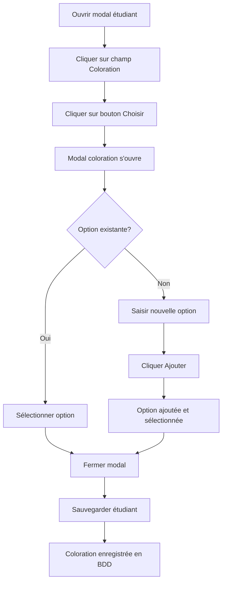

# 🎨 Guide de la Fonctionnalité "Coloration"

## 📋 Description

La fonctionnalité "Coloration" permet d'assigner des spécialisations ou des options particulières aux étudiants dans le système U52 BTS Électrotechnique.

## ✨ Fonctionnalités

### 🔧 Options par défaut
- **Pas de coloration** (option par défaut)
- **Ecole des reseaux** - Affiche le logo "logo-ecole-reseaux.png"
- **Protendem** - Affiche le logo "logo-protendem.png"

### 🎨 Affichage des logos
- Les logos correspondants s'affichent automatiquement à côté du nom de l'étudiant
- Logos de 80x80 pixels (20x20 en Tailwind) par défaut
- Tooltip au survol affichant le nom de la coloration

### ➕ Ajout d'options personnalisées
- Possibilité d'ajouter de nouvelles options de coloration directement depuis le modal
- Les nouvelles options sont sauvegardées et réutilisables
- Les nouvelles options n'ont pas de logo (affichage texte uniquement)

## 🚀 Comment utiliser

### 1. Accéder au modal de coloration
1. Allez dans la section **"Étudiants"**
2. Cliquez sur **"Modifier"** (icône crayon) pour un étudiant
3. Dans le modal "Modifier l'étudiant", cliquez sur le champ **"Coloration"**
4. Cliquez sur le bouton **"Choisir"**

### 2. Sélectionner une coloration
1. Le modal "Choisir une coloration" s'ouvre
2. Cliquez sur l'option souhaitée parmi :
   - Pas de coloration
   - Ecole des reseaux
   - Protendem
   - Ou toute autre option ajoutée précédemment

### 3. Ajouter une nouvelle coloration
1. Dans le modal "Choisir une coloration"
2. Saisissez le nom de la nouvelle coloration dans le champ **"Nouvelle coloration"**
3. Cliquez sur **"Ajouter"**
4. La nouvelle option sera automatiquement sélectionnée et ajoutée à la liste

## 🔧 Implémentation technique

### Frontend (React)
- **Fichiers modifiés** : 
  - `client/src/pages/Students.js` - Affichage des étudiants avec logos
  - `client/src/components/ColorationLogo.js` - Composant réutilisable pour les logos
- **Nouveaux états** :
  - `showColorationModal` : Contrôle l'affichage du modal
  - `colorationOptions` : Liste des options disponibles
- **Nouvelles fonctions** :
  - `handleAddColorationOption()` : Ajoute une nouvelle option
  - `handleRemoveColorationOption()` : Supprime une option (non implémenté dans l'UI)
  - `handleColorationSelect()` : Sélectionne une coloration
- **Composant ColorationLogo** :
  - Affichage conditionnel des logos selon la coloration
  - Support des props `className` et `showTitle`
  - Gestion automatique des chemins d'images

### Backend (Node.js/Express)
- **Base de données** : Nouvelle colonne `coloration TEXT` dans la table `students`
- **Migration automatique** : La colonne est ajoutée automatiquement si elle n'existe pas
- **API** : Les routes POST et PUT gèrent le champ `coloration`

### Assets (Logos)
- **Fichiers** :
  - `client/public/logo-ecole-reseaux.png` - Logo pour "Ecole des reseaux"
  - `client/public/logo-protendem.png` - Logo pour "Protendem"
- **Source** : Copiés depuis la racine du projet vers `client/public/`
- **Format** : PNG avec transparence
- **Taille d'affichage** : 80x80 pixels par défaut (configurable via props)

### Base de données
- **Table** : `students`
- **Nouvelle colonne** : `coloration TEXT`
- **Migration** : Ajoutée automatiquement via `ALTER TABLE students ADD COLUMN coloration TEXT`

## 📊 Structure des données

### Étudiant (table students)
```sql
CREATE TABLE students (
  id INTEGER PRIMARY KEY AUTOINCREMENT,
  first_name TEXT NOT NULL,
  last_name TEXT NOT NULL,
  date_de_naissance DATE,
  email TEXT,
  class TEXT,
  class_id INTEGER,
  group_id INTEGER,
  project_id INTEGER,
  role TEXT,
  coloration TEXT,  -- ✅ NOUVELLE COLONNE
  school_year TEXT DEFAULT '2025-2026',
  created_at DATETIME DEFAULT CURRENT_TIMESTAMP,
  FOREIGN KEY (project_id) REFERENCES projects(id),
  FOREIGN KEY (group_id) REFERENCES groups(id),
  FOREIGN KEY (class_id) REFERENCES classes(id)
);
```

## 🎯 Cas d'usage

### 1. Étudiants sans spécialisation
- **Coloration** : "Pas de coloration"
- **Utilisation** : Étudiants en parcours standard

### 2. Étudiants en réseau
- **Coloration** : "Ecole des reseaux"
- **Utilisation** : Étudiants suivant des modules spécialisés réseaux

### 3. Étudiants Protendem
- **Coloration** : "Protendem"
- **Utilisation** : Étudiants dans le cadre du programme Protendem

### 4. Autres spécialisations
- **Coloration** : Options personnalisées
- **Utilisation** : Toute autre spécialisation définie par l'établissement

## 🔄 Workflow complet



## 🛠️ Maintenance

### Ajouter des options par défaut
Pour ajouter des options par défaut, modifiez le tableau `colorationOptions` dans `client/src/pages/Students.js` :

```javascript
const [colorationOptions, setColorationOptions] = useState([
  'Pas de coloration',
  'Ecole des reseaux',
  'Protendem',
  'Nouvelle option'  // ✅ Ajouter ici
]);
```

### Utiliser le composant ColorationLogo
Le composant `ColorationLogo` peut être utilisé partout dans l'application :

```jsx
import ColorationLogo from '../components/ColorationLogo';

// Usage basique
<ColorationLogo coloration="Ecole des reseaux" />

// Usage avec taille personnalisée
<ColorationLogo 
  coloration="Protendem" 
  className="h-8 w-8" 
  showTitle={false} 
/>
```

### Ajouter un nouveau logo
Pour ajouter un logo pour une nouvelle coloration :

1. **Copier le logo** dans `client/public/logo-nouvelle-coloration.png`
2. **Modifier** `client/src/components/ColorationLogo.js` :

```javascript
switch (coloration.toLowerCase()) {
  case 'ecole des reseaux':
  case 'école des réseaux':
    return '/logo-ecole-reseaux.png';
  case 'protendem':
    return '/logo-protendem.png';
  case 'nouvelle coloration':  // ✅ Ajouter ici
    return '/logo-nouvelle-coloration.png';
  default:
    return null;
}
```

### Persistance des options
Actuellement, les options ajoutées dynamiquement ne sont pas persistées en base de données. Pour une persistance complète, il faudrait :
1. Créer une table `coloration_options`
2. Sauvegarder les nouvelles options en base
3. Charger les options depuis la base au démarrage

## 🐛 Résolution de problèmes

### Problème : La colonne coloration n'apparaît pas
**Solution** : Redémarrer le serveur backend pour déclencher la migration automatique

### Problème : Les nouvelles options ne persistent pas
**Solution** : Les options ajoutées dynamiquement sont temporaires. Redémarrer l'application les remet aux valeurs par défaut.

### Problème : Erreur lors de la sauvegarde
**Solution** : Vérifier que le serveur backend est démarré et que la migration s'est bien effectuée.

## 📝 Notes importantes

- ✅ **Migration automatique** : La colonne `coloration` est ajoutée automatiquement
- ✅ **API complète** : POST et PUT gèrent le champ `coloration`
- ✅ **Interface intuitive** : Modal dédié pour la sélection
- ⚠️ **Options temporaires** : Les nouvelles options ne persistent qu'en session
- ✅ **Validation** : Pas de validation stricte, champ optionnel

---

**Développé pour U52 BTS Électrotechnique** 🎓
